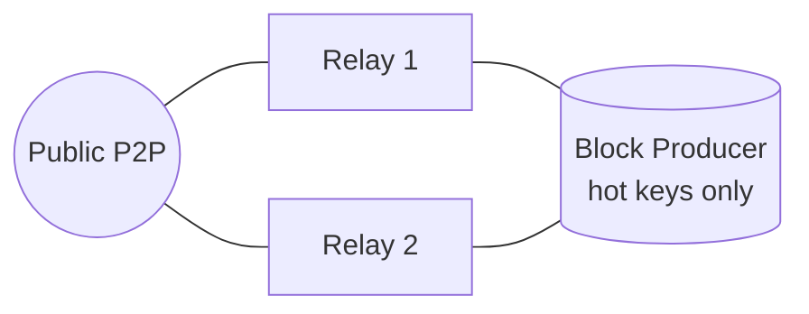

# Block Producer Setup Guide

End-to-end runbook for deploying a **Cardano** or **ApexFusion** block producer
(BP) with the Hybrid-Node image. A BP is the node that holds your pool's hot
keys and forges blocks. It must run **behind your own relays**, never be exposed
to the public internet, and never hold cold keys.

> This guide ties together the deployment, security, and topology docs. Read
> [Secrets Management](security/secrets.md), [Topology & Custom Peers](operations/topology.md),
> and [Host Firewall](security/firewall.md) alongside it.

---

## 1. Architecture



- The **BP connects only to your relays**; relays face the public network.
- The BP port is reachable **only from relay IPs** (host firewall + K8s NetworkPolicy).
- The BP carries the **hot key set only** (`kes.skey`/`hot.skey`, `vrf.skey`, `op.cert`).
  Cold/payment/stake keys stay offline. See [Secrets Management](security/secrets.md).

---

## 2. Prerequisites

- [ ] **Pool already registered on-chain** (pool ID, metadata, pledge, registration cert).
      This guide covers *running* a BP, not the initial pool registration.
- [ ] **At least two synced relays** deployed and healthy (see [deployment.md](deployment.md)).
- [ ] **Hot key set generated** on your offline machine:
      `kes.skey` (or Guild `hot.skey`), `vrf.skey`, `op.cert`.
- [ ] Cold keys (`cold.skey`, `cold.counter`) live **only** on the offline/air-gapped
      host — they are needed to issue the `op.cert`, not to run the BP.
- [ ] Host sized per [Resource Requirements & Tuning](operations/resource-tuning.md)
      (mainnet BP: ~16Gi request / 24Gi limit, 4 cores, SSD/NVMe DB).

> ⚠️ **Never copy cold, payment, or stake keys to the BP host.** The node never
> reads them. See the [BP key layout](security/secrets.md#file-layout-on-bp).

---

## 3. Key handling

A BP needs exactly this under `/opt/cardano/cnode/priv/pool/<POOL_NAME>/`:

```text
kes.skey / hot.skey   ← hot key (rotated ~every 62 epochs)
vrf.skey              ← VRF key (permanent per pool)
op.cert               ← operational certificate (renewed with KES)
*.vkey                ← public verification keys (fine to keep)
```

Set restrictive permissions:

```bash
chmod 400 /opt/cardano/cnode/priv/pool/<POOL_NAME>/*.skey
```

Full classification, at-rest encryption (CNTools/air-gap), and the read-only
audit script are in [Secrets Management](security/secrets.md).

---

## 4. Deploy the BP

Pick **one** of the following. Helm is recommended for k3s fleets.

### Option A — Docker

```bash
docker pull ghcr.io/gvolcy/hybrid-node:cardano-10.6.3

docker run -d \
  --name cardano-bp \
  -e NETWORK=mainnet \
  -e NODE_MODE=bp \
  -e NODE_PORT=6000 \
  -e POOL_NAME=MYPOOL \
  -e CNCLI_ENABLED=Y \
  -e MITHRIL_SIGNER=Y \
  -v cardano-db:/opt/cardano/cnode/db \
  -v /opt/cardano/cnode/priv:/opt/cardano/cnode/priv \
  -v cardano-sockets:/opt/cardano/cnode/sockets \
  -v cardano-guild-db:/opt/cardano/cnode/guild-db \
  -p 6000:6000 \
  --restart unless-stopped \
  ghcr.io/gvolcy/hybrid-node:cardano-10.6.3
```

### Option B — Helm (k3s)

1. Create the K8s secret with your hot keys:

   ```bash
   kubectl -n <ns> create secret generic pool-keys \
     --from-file=hot.skey=./hot.skey \
     --from-file=vrf.skey=./vrf.skey \
     --from-file=op.cert=./op.cert
   ```

2. Install using the BP example values
   ([values-bp-example.yaml](../charts/hybrid-node/values-bp-example.yaml)):

   ```bash
   helm install cardano-bp ./charts/hybrid-node \
     -f charts/hybrid-node/values-bp-example.yaml -n <ns>
   ```

   Key BP settings in that file:

   ```yaml
   cardano:
     mode: bp
     cncliEnabled: "Y"       # leaderlog / validate
   kesSecret:
     enabled: true
     secretName: "pool-keys"
   networkPolicy:
     enabled: true           # restrict BP to relay IPs (see step 6)
     allowedRelayCIDRs: ["1.2.3.4/32", "5.6.7.8/32"]
   ```

### Option C — Raw k3s manifest

```bash
kubectl apply -f chains/cardano/k3s/bp.yaml
# ApexFusion:
kubectl apply -f chains/apexfusion/k3s/bp.yaml
```

---

## 5. Lock down topology (own relays only)

A BP must peer **only** with your relays and never fetch public/ledger peers.

- **Docker/env:** set `CUSTOM_PEERS="relay1:6000,relay2:6000"`.
  In ApexFusion BP mode, `CUSTOM_PEERS` **replaces the entire topology** (strict mode).
- **Helm/full control:** use `topologyOverride` with `publicRoots: []` and
  `useLedgerAfterSlot: -1`.

Full examples (relay vs BP) are in [Topology & Custom Peers](operations/topology.md#block-producer--connect-only-to-your-own-relays-never-the-public-network).

---

## 6. Protect the BP

Two independent layers — apply **both**:

1. **Kubernetes NetworkPolicy** — pod-to-pod. Set `networkPolicy.enabled: true`
   and list your relay CIDRs (`charts/hybrid-node/templates/networkpolicy.yaml`).
2. **Host firewall (UFW)** — open the BP node port **only from relay source IPs**.
   See [Host Firewall](security/firewall.md#reference-relay-vs-bp-exposure-best-practice).

> ⚠️ The BP Service should be `ClusterIP` (never `NodePort`/`LoadBalancer`).
> The BP P2P port must never be reachable from the public internet.

---

## 7. Enable pool operations (optional but recommended)

| Feature | Env / value | Purpose |
| ------- | ----------- | ------- |
| CNCLI leaderlog | `CNCLI_ENABLED=Y` / `cncliEnabled: "Y"` | Slot-leader schedule, block validation |
| Mithril signer | `MITHRIL_SIGNER=Y` / `mithrilSigner: "Y"` | Sign Mithril certificates (Cardano only) |
| PoolTool tip | `POOL_ID` + `PT_API_KEY` | Report tip/height to pooltool.io |

Mithril signer setup and the DMQ variant are documented in
[scripts/mithril/README.md](../scripts/mithril/README.md).

---

## 8. Verify

```bash
# Full health sweep
scripts/health/check-all.sh <bp>

# Individual
scripts/health/check-sync.sh <bp>     # tip matches network
scripts/health/check-peers.sh <bp>    # sees ONLY your relays (no public peers)
scripts/health/check-kes.sh <bp>      # KES remaining periods > 0
```

Inside the pod, `gLiveView` should show the **block-production panel** (KES,
opcert, Leader/Ideal/Luck). If the delegator/stake panel is missing, see the
[gLiveView Koios note](../chains/cardano/README.md#gliveview--missing-delegator--stake-panel).

Confirm leader schedule (CNCLI):

```bash
kubectl -n <ns> exec <pod> -c cardano-node -- \
  bash -lc 'cardano-cli query leadership-schedule --current ...'
# or check cncli leaderlog output in guild-db
```

---

## 9. KES rotation (recurring)

KES keys expire every **~62 epochs (~62 days)**. Rotating requires the **cold
key** on your offline host to issue a fresh `op.cert`. Full command sequence is
in [Secrets Management → KES Key Rotation](security/secrets.md#kes-key-rotation).

Short version:

1. On the offline host: `key-gen-KES` → `issue-op-cert` (bumps the counter).
2. Copy **only** `kes.skey` + `op.cert` to the BP.
3. Restart the BP (`docker restart` / rollout).
4. `scripts/health/check-kes.sh <bp>` → confirm remaining periods reset.

> 🔔 Set a calendar/alert reminder ~1 week before expiry. A lapsed KES = the pool
> stops forging. Consider a Prometheus alert on KES remaining periods.

---

## 10. ApexFusion differences

ApexFusion runs cardano-node, so the key types and flow are identical. Notable
differences:

- Networks: `afpm` (mainnet) / `afpt` (testnet) instead of `mainnet`/`preprod`.
- **No Mithril** — bootstrap and recovery are full re-sync or NAS restore.
- BP topology: `CUSTOM_PEERS` in BP mode is **strict** (replaces topology entirely).
- The `gLiveView` delegator/stake panel is **not available** (no ApexFusion Koios).

See [chains/apexfusion/README.md](../chains/apexfusion/README.md) for env vars and k3s manifests.

---

## 11. Go-live checklist

- [ ] Two+ relays synced and healthy
- [ ] Only `kes.skey`/`hot.skey`, `vrf.skey`, `op.cert` on the BP (`chmod 400`)
- [ ] No cold/payment/stake keys on the BP ([audit](security/secrets.md#auditing--at-rest-protection) passes)
- [ ] BP topology locked to your relays (`publicRoots: []` / strict `CUSTOM_PEERS`)
- [ ] NetworkPolicy enabled with relay CIDRs
- [ ] Host firewall opens BP port to relay IPs only; Service is `ClusterIP`
- [ ] `check-sync`, `check-peers`, `check-kes` all green
- [ ] CNCLI leaderlog producing a schedule
- [ ] KES expiry reminder/alert set

---

## Related

- [Deployment Guide](deployment.md)
- [Secrets Management](security/secrets.md)
- [Topology & Custom Peers](operations/topology.md)
- [Host Firewall](security/firewall.md)
- [Resource Requirements & Tuning](operations/resource-tuning.md)
- [Upgrade](operations/upgrade-playbook.md) / [Rollback](operations/rollback-playbook.md) Playbooks
